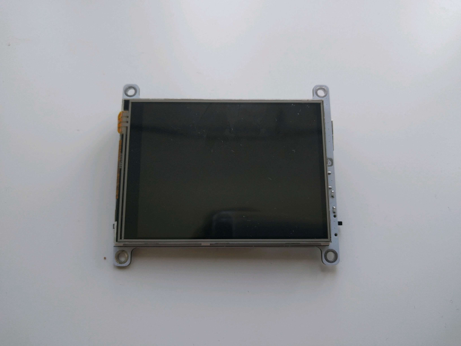
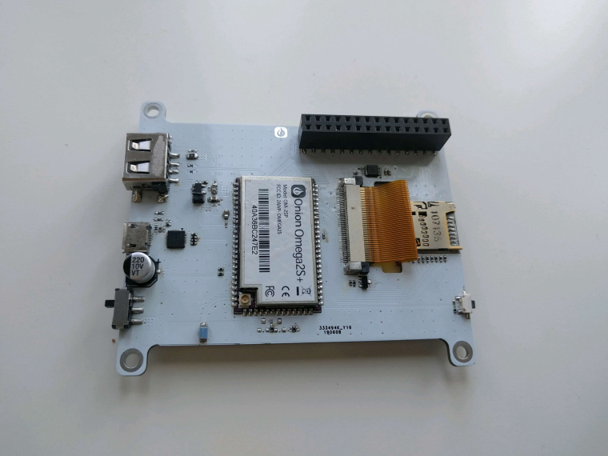

# Omega2-Dash
Onion Omega2 Dash IoT Computer - a touchscreen device based on the Omega2




# Bring-Up Guide

Test firmware for the Omega2 Dash is available: [`omega2-dash-v0.3.2-b228.bin`](./bin/omega2-dash-v0.3.2-b228.bin)

Steps to flash your Omega2 Dash:

- Download the `omega2-dash-v0.3.2-b228.bin` firmware to the `/tmp` directory on your Omega2 Dash
- Use `sysupgrade` to install the firmware: `sysupgrade -n -v /tmp/omega2-dash-v0.3.2-b228.bin`
- Wait until it reboots, and then reboot again

This firmware has a kernel driver for the ILI9341 TFT driver and enables a framebuffer device, `/dev/fb0`.

## Backlight Control

Backlight is controlled by GPIO21 (PWM Channel 3)

- 100% duty cycle = min brightness
- 0% duty cycle = max brightness


```
omega2-ctrl gpiomux set uart2 pwm23
onion pwm 3 50 120

omega2-ctrl gpiomux set uart2 pwm23
onion pwm 3 0 120
```

## Touch Driver

Using XPT7603 controller, connected to Omega via I2C

- I2C Address: 0x48
- Interrupt pin: GPIO14

Shell commands to test touch input:

```
#read X
i2cget -y 0 0x48 0x88 w

#read Y
i2cget -y 0 0x48 0x98 w
```


## Controlling the Display

By default, the framebuffer is connected to the `/dev/tty1` virtual device.

Try echoing to this tty and you'll see the contents printed on the display!

```
echo "hello from the Omega2 Dash" > /dev/tty1
```

The **blinking cursor** on the display can be disabled:

```
echo 0 > /sys/class/graphics/fbcon/cursor_blink
```

To enable it again, just echo a `1` instead.

The **orientation** of the display can also be changed:

```
echo 1 > /sys/class/graphics/fbcon/rotate
```

Valid options are `0`, `1`, `2`, and `3`


# Demos

## LittleVGL UI Demo

Demo of a touch-enabled GUI made with LittleV Graphics Library:


Steps to run on your Omega2 Dash:

- Download [`o2-dash-lvgl-demo`](./bin/o2-dash-lvgl-demo) to your Omega
- Make it executable: `chmod +x o2-dash-lvgl-demo`
- Run it: `./o2-dash-lvgl-demo`
