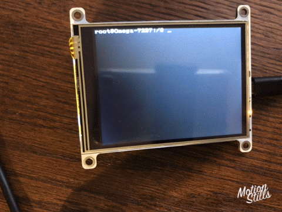
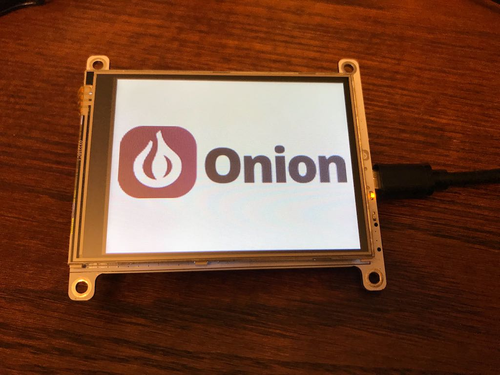
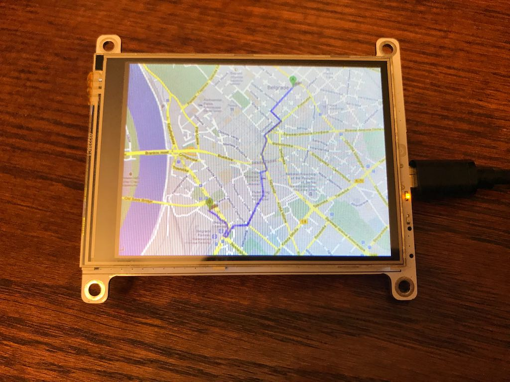
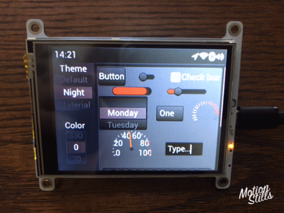
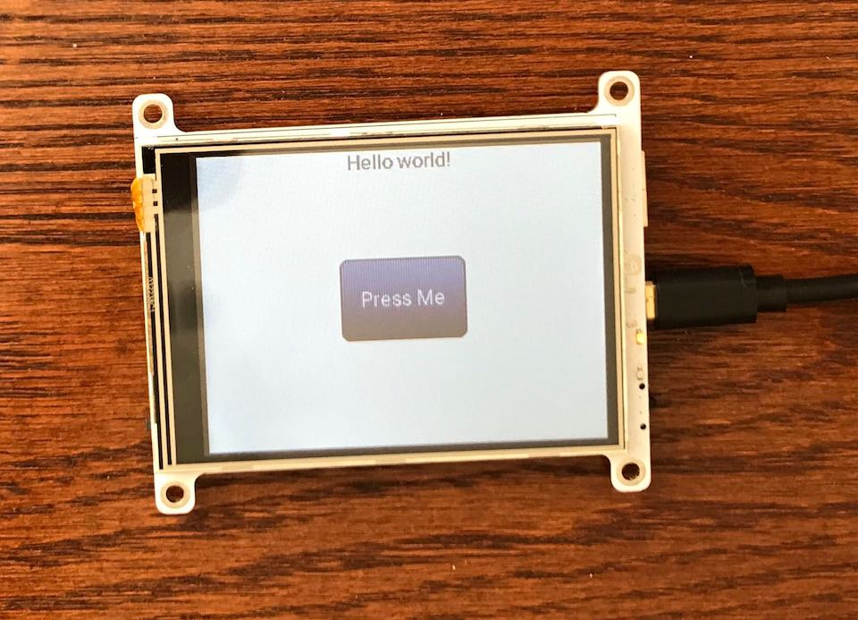

# Omega2-Dash
Onion Omega2 Dash IoT Computer - a touchscreen device based on the Omega2


# Getting Started

Get your Omega2 Dash up and running by following the [Omega2 Dash guide](https://onion.io/omega2-dash-guide).

# Hardware Info

Schematics and layout images along with physical measurements are available for the Omega2 Dash in the [Hardware](./Hardware) directory.

# Firmware Info

Firmware for the Omega2 Dash is built using [Onion's fork of the OpenWRT source repo](https://github.com/OnionIoT/source). 

Differences from the regular Omega2/Omega2+ firmware include:

* Includes kernel driver for the ILI9341 TFT driver. This enables the `/dev/fb0` framebuffer device.
* Includes the `omega2-dash-base` software package

To build firmware for the Omega2 Dash using Onion's OpenWRT source repo, run `python scripts/onion-setup-build.py -c .config.O2Dash` before launching the compilation.

For more details, see [the `omega2-dash-base` package in Onion's OpenWRT Packages Repo](https://github.com/OnionIoT/OpenWRT-Packages/tree/openwrt-18.06/omega2-dash).

# Doing Things with the Omega2 Dash

Everything you need to know about using the Omega2 Dash can be found in the [Omega2 Dash guide](https://onion.io/omega2-dash-guide/#doing-things).

The topics below are available for quick reference.

## Backlight Control

Backlight is controlled by GPIO21 (PWM Channel 3)

- 100% duty cycle = min brightness
- 0% duty cycle = max brightness


```
omega2-ctrl gpiomux set uart2 pwm23
onion pwm 3 50 120

omega2-ctrl gpiomux set uart2 pwm23
onion pwm 3 0 120
```

> The **second-last** argument controls the duty cycle.

## Touch Driver

Using XPT7603 controller, connected to Omega via I2C

- I2C Address: 0x48
- Interrupt pin: GPIO14

Shell commands to test touch input:

```
#read X
i2cget -y 0 0x48 0x88 w

#read Y
i2cget -y 0 0x48 0x98 w
```


## Controlling the Display

By default, the framebuffer is connected to the `/dev/tty1` virtual device.

Try echoing to this tty and you'll see the contents printed on the display!

```
echo "hello from the Omega2 Dash" > /dev/tty1
```

The **blinking cursor** on the display can be disabled:

```
echo 0 > /sys/class/graphics/fbcon/cursor_blink
```

To enable it again, just echo a `1` instead.

The **orientation** of the display can also be changed:

```
echo 1 > /sys/class/graphics/fbcon/rotate
```

Valid options are `0`, `1`, `2`, and `3`


# Demos

## Terminal Demo

Running the Omega's terminal on the display:



- Run `sh > /dev/tty0` on your Omega2 Dash. Everything you type from then on will show up on the display and not in your terminal window
- Hit `ctrl+d` to exit

## Displaying png & jpg Images

Display image files:



Steps to display images on your Omega2 Dash:
- First install the fbi package: `opkg update ; opkg install fbi`
  - This only needs to be done once
- [Transfer](http://docs.onion.io/omega2-docs/transferring-files.html) image files to the Omega. Supported file types are png, jpg
- Display the images by running `fbi -d /dev/fb0 -notty -nocomments --noverbose <PATH TO IMAGE FILE>`
 
For example: `fbi -d /dev/fb0 -notty -nocomments --noverbose /root/map.png`
 
The fbi program is really flexible, try running it with multiple files and see what happens!

## LittleVGL UI Demo

Demo of a touch-enabled GUI made with LittleV Graphics Library:



Steps to run on your Omega2 Dash:

- Download [`bin/o2-dash-lvgl-demo` from this repo](./bin/o2-dash-lvgl-demo) to your Omega
- Make it executable: `chmod +x o2-dash-lvgl-demo`
- Run it: `./o2-dash-lvgl-demo`

## LittleVGL Example Program

We've put together an program that can serve as the starting for Omega2 Dash programs using the LittleV Graphics Library. See the repo here: https://github.com/OnionIoT/lv_example

Out of the box it supports:
* The Linux Framebuffer - will draw to the Omega2 Dash display 
* The XPT7603 touch input device on the Omega2 Dash
* A makefile and instructions to build it as an OpenWRT package
* A small demo

Use this to get started with your own lvgl programs!



Steps to run the existing example on your Omega2 Dash:

- Download [`bin/lv_example` from this repo](./bin/lv_example) to your Omega
- Make it executable: `chmod +x lv_example`
- Run it: `./lv_example`
